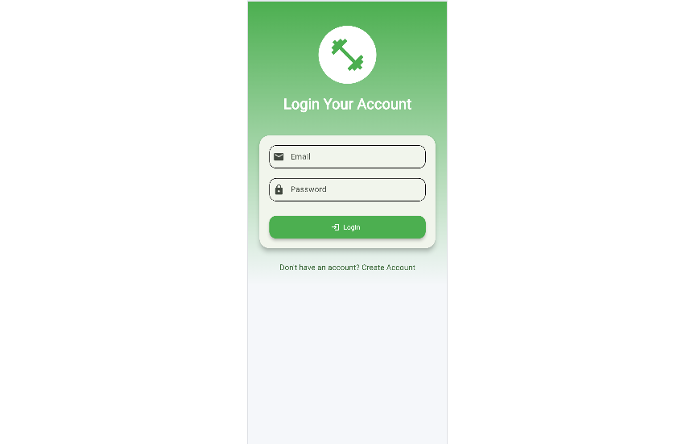
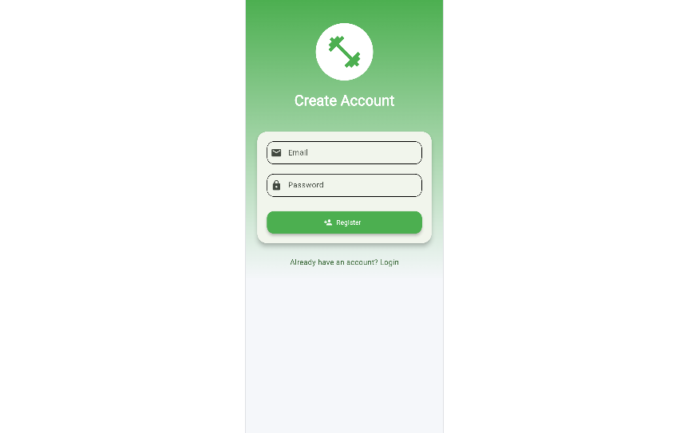
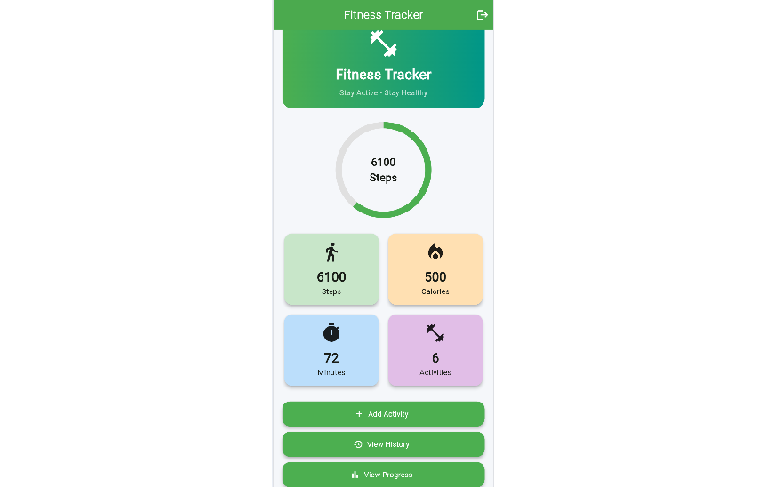
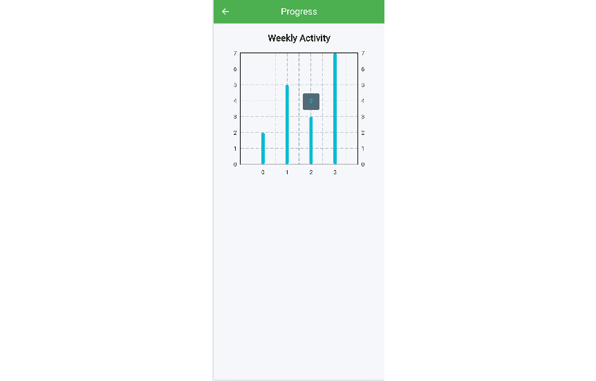

# Fitness Tracker App

A modern Flutter-based Fitness Tracker application integrated with Firebase Authentication and Cloud Firestore. The application allows users to record fitness activities, monitor progress, track calories burned, and maintain a history of workouts through a clean and user-friendly interface.


## Project Overview

The Fitness Tracker App helps users maintain and monitor their daily fitness activities. Users can register, log in securely, add workout records, and view their fitness progress through an interactive dashboard.

This project was developed using Flutter and Firebase as part of an academic software development project.


## Features

### Authentication
- User Registration
- User Login
- Firebase Authentication
- Secure User Sessions
- Logout Functionality

### Activity Tracking
- Add Fitness Activities
- Record Exercise Type
- Track Workout Duration
- Track Calories Burned
- Store Records in Firestore

### Dashboard
- Total Activities Summary
- Calories Tracking
- Workout Duration Tracking
- Steps Tracking
- Progress Visualization

### Progress Monitoring
- View Fitness Progress
- Activity Statistics
- Daily Workout Tracking

### User Interface
- Modern Fitness Theme
- Responsive Design
- Animated Navigation
- Attractive Dashboard
- Material Design Components


## Technologies Used

| Technology | Purpose |
|------------|----------|
| Flutter | Cross-platform mobile development |
| Dart | Programming Language |
| Firebase Authentication | User Authentication |
| Cloud Firestore | Database Storage |
| Material Design | UI Components |
| Git & GitHub | Version Control |


## Installation Guide

### 1. Clone Repository

```bash
git clone https://github.com/Dev-Moiz886/fitness-tracker-app.git
```

### 2. Navigate to Project

```bash
cd fitness-tracker-app
```

### 3. Install Dependencies

```bash
flutter pub get
```

### 4. Configure Firebase

Create a Firebase project and connect it with Flutter using FlutterFire CLI.

```bash
flutterfire configure
```

### 5. Run Application

```bash
flutter run
```


## Firebase Configuration

The application uses:

- Firebase Authentication
- Cloud Firestore Database

### Firebase Services

#### Authentication

- Email/Password Sign In
- User Registration
- Secure Authentication

#### Firestore

Stores:

- Activity Name
- Workout Duration
- Calories Burned
- Activity History
- User Records


## Screenshots

### Login Screen



### Register Screen



### Dashboard



### Add Activity


### Progress Screen




## Future Improvements

- Google Sign-In
- Dark Mode
- Weekly Analytics
- Monthly Reports
- Activity Categories
- Push Notifications
- Fitness Goals
- Charts and Graphs
- Profile Management


## Learning Outcomes

This project demonstrates:

- Flutter UI Development
- Firebase Authentication
- Firestore Database Integration
- State Management
- Navigation and Routing
- Form Validation
- Mobile App Design
- GitHub Version Control


## Contributing

Contributions are welcome.

1. Fork the repository
2. Create a feature branch

```bash
git checkout -b feature-name
```

3. Commit changes

```bash
git commit -m "Add new feature"
```

4. Push changes

```bash
git push origin feature-name
```

5. Open a Pull Request


## Author

**Abdul Moiz**